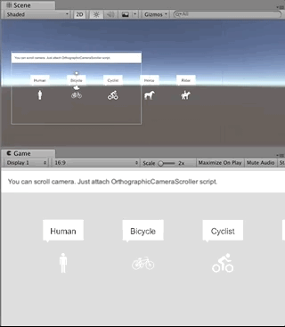

# camera_scroller

## What

* Camera scroller script for Unity3D

## Requirement

* Nothing

## Install

```shell
yarn add "umm/camera_scroller#^1.0.0"
```

## Usage

Just attach OrthographicCameraScroller script.



## License

Copyright (c) 2018 Takuma Maruyama

Released under the MIT license, see [LICENSE.txt](LICENSE.txt)

